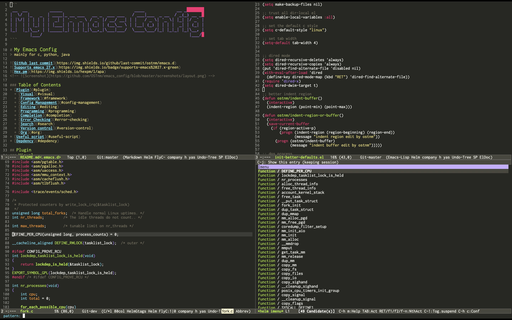

```
 __  __         _____                             ____             __ _       
|  \/  |_   _  | ____|_ __ ___   __ _  ___ ___   / ___|___  _ __  / _(_) __ _ 
| |\/| | | | | |  _| | '_ ` _ \ / _` |/ __/ __| | |   / _ \| '_ \| |_| |/ _` |
| |  | | |_| | | |___| | | | | | (_| | (__\__ \ | |__| (_) | | | |  _| | (_| |
|_|  |_|\__, | |_____|_| |_| |_|\__,_|\___|___/  \____\___/|_| |_|_| |_|\__, |
        |___/                                                           |___/ 
```

# My Emacs Config
> mainly for c, python, java




### Table of Contents
* [Plugin](#plugin)
  + [Visual](#visual)
  + [Framework](#framework)
  + [Config Management](#config-management)
  + [Editing](#editing)
  + [Programming](#programming)
  + [Completion](#completion)
  + [Error Checking](#error-checking)
  + [Search](#search)
  + [Version control](#version-control)
  + [Org](#org)
* [Useful script](#useful-script)
* [Depdency](#depdency)

## Plugin
### Visual
* [column-enforce](https://github.com/jordonbiondo/column-enforce-mode)
Highlight text that extends beyond a certain column.
* [goto-line-preview](https://github.com/jcs-elpa/goto-line-preview)
Preview line when executing goto-line command.
* [monokai-theme](https://github.com/oneKelvinSmith/monokai-emacs)
Textmate theme.
* [rainbow-delimiters](https://github.com/Fanael/rainbow-delimiters)
Highlights parentheses, brackets, and braces according to their depth.
* [undo-tree](https://www.emacswiki.org/emacs/UndoTree)
Visualize the whole undo history in buffer as a tree, and you can access anywhere in it.

### Framework
* [helm](https://github.com/emacs-helm/helm)
An emacs framework for incremental completions and narrowing selections.

### Config Management
* [bug-hunter](https://github.com/Malabarba/elisp-bug-hunter)
An emacs library that finds the source of an error or unexpected behavior inside an elisp configuration file.

### Editing
* [hungry-delete](https://github.com/soutaro/hungry-delete.el)
Delete an entire block of whitespace at point.
* [move-text](https://github.com/emacsfodder/move-text)
Move current line or region up or down.
* [multiple-cursors](https://github.com/magnars/multiple-cursors.el)
Mark, edit multiple lines at once.
* [window-numbering](https://github.com/nschum/window-numbering.el)
Numbered window shortcuts for emacs.

### Programming
* [yasnippet](https://github.com/joaotavora/yasnippet)
A template system that allows you to type an abbreviation and automatically expand it into function templates.
+ [yasnippet-snippets](https://github.com/AndreaCrotti/yasnippet-snippets)
The official collection of snippets for yasnippet.
* [helm-c-yasnippet](https://github.com/emacs-jp/helm-c-yasnippet)
Helm source for yasnippet.el
* [lsp-java](https://github.com/emacs-lsp/lsp-java)
Emacs java ide using eclipse jdt language server.
* [quickrun](https://github.com/emacsorphanage/quickrun)
Execute editing buffer.
* [smartparens](https://github.com/Fuco1/smartparens)
Deals with parens pairs and tries to be smart about it.

### Completion
* [company](http://company-mode.github.io/)
A text completion framework.
  + [company-box](https://github.com/sebastiencs/company-box)
A company front-end with icons.
* [helm-company](https://github.com/Sodel-the-Vociferous/helm-company)
Helm interface for company-mode.

### Error Checking
* [flycheck](https://github.com/flycheck/flycheck)
Modern on-the-fly syntax checking extension.

### Search
* [helm-ag](https://github.com/emacsorphanage/helm-ag)
Ag with helm interface.

### Version control
* [magit](https://magit.vc/)
Interacting with git.

### Org
* [org-download](https://github.com/abo-abo/org-download)
Drag and drop images to emacs org-mode.

## Useful scripts
* [bing-dict-ee](./lisp/init-packages.el) + [translate](./bin/translate.py)
Bing translator in buffer.
* [cflow-function](./lisp/init-packages.el)
Get call graph of inputed function.
* [dos-eol](./lisp/init-better-defaults.el)
Unix2dos.
* [indent-region-or-buffer](./lisp/init-better-defaults.el)
Indent region.
* [delete-trailing-whitespace](./lisp/init-better-defaults.el)
Delete trailing-whitespace mathching by regxp in certatin directory.
* [c-funcall-name-face](./lisp/init-ui.el)
Highlight c function defintion.

## Dependency
* cflow
* python
  + requests
  + beautifulsoup4
